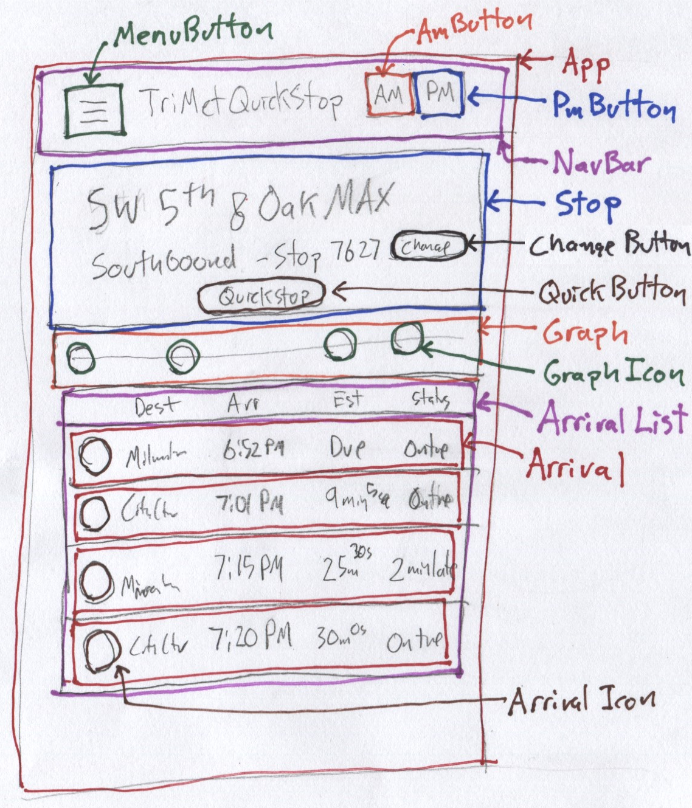
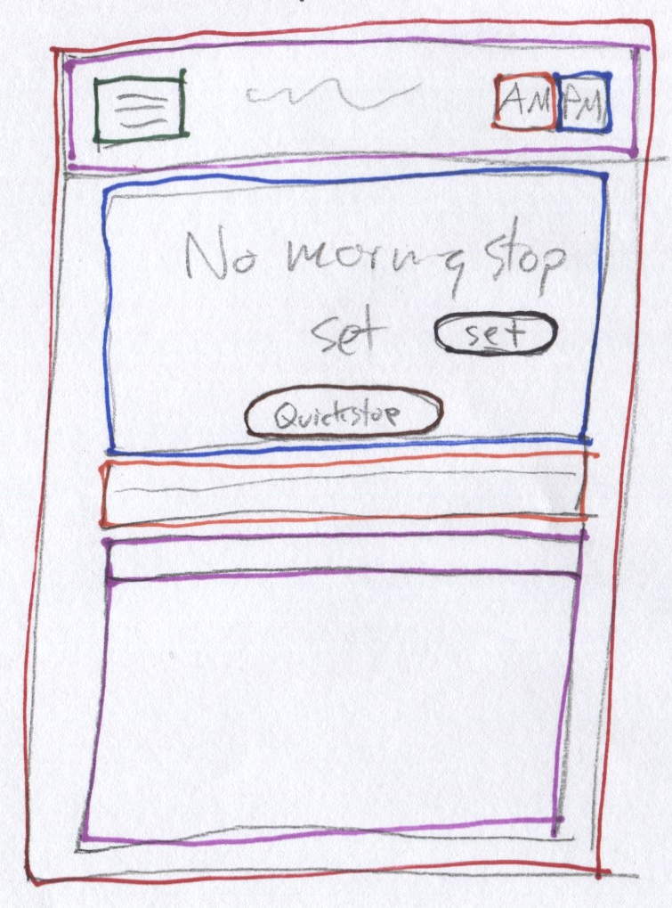
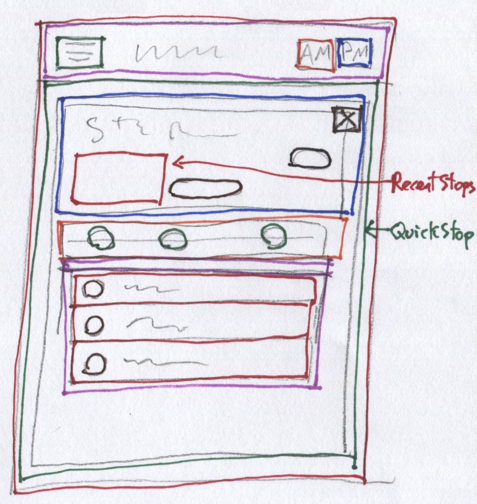
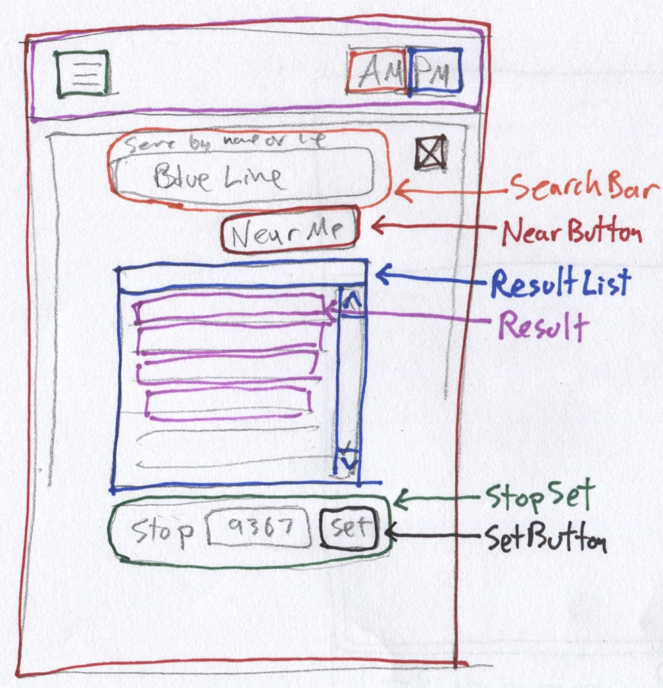
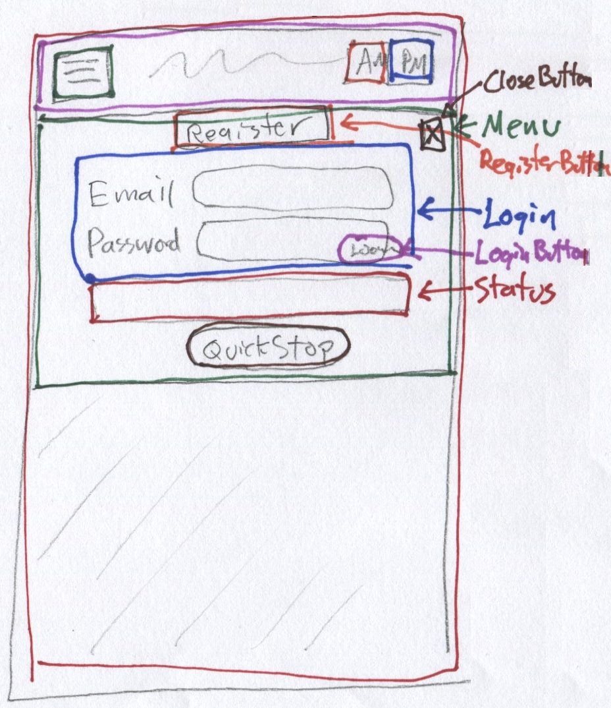
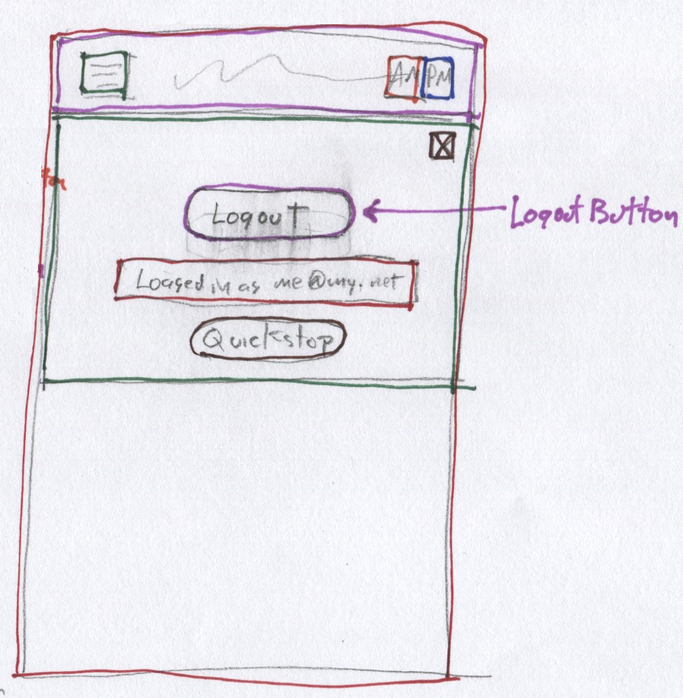
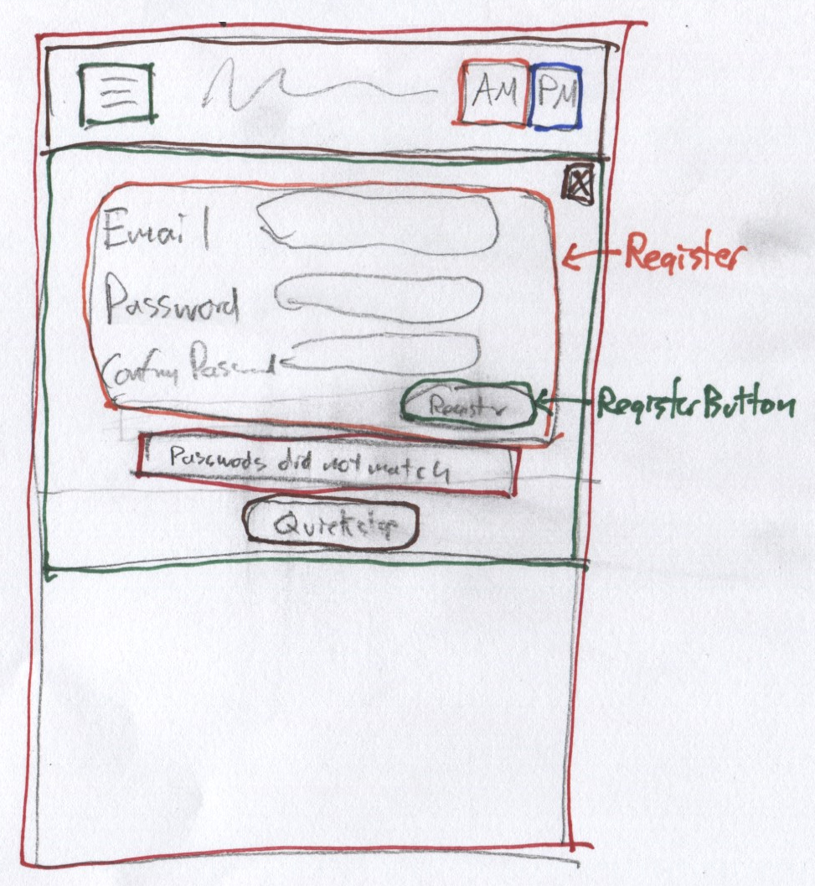

# TriMet QuickStop Components

## Component Tree

App
- NavBar
  - MenuButton
  - AmButton
  - PmButton
- StopPane
  - Stop
    - CloseButton
    - ChangeButton
    - QuickstopButton
    - RecentList
      - Recent (xN)
  - Graph
    - GraphIcon (xN)
  - ArrivalList
    - Arrival (xN)
      - ArrivalIcon
- MapPane
  - CloseButton
  - Map
    - MapIcon
- SearchPane
  - CloseButton
  - SearchBar
  - NearButton
  - ResultList
    - Result (xN)
  - StopSet
    - SetButton
- MenuPane
  - CloseButton
  - User
    - Login
      - RegisterButton
      - LoginForm
      - LoginButton
    - Logout
      - LogoutButton
    - Register
      - RegisterForm
      - RegisterButton
  - Status
  - QuickstopButton

## Application Sketches

I created these sketches of the various dynamic states of the app in order to sort out the component hierarchy

#### Normal Mode (morning/evening stop set)

#### Setup Mode (morning/evening stop not set)

#### QuickStop Mode (quick stop set)

#### Map Overlay (map showing vehicle/stop location)

#### Set Stop Overlay (stop selection by location/address/line)

#### Login Overlay (menu when logged out)

#### Logout Overlay (menu when logged in)

#### Register Overlay (menu when registering)

